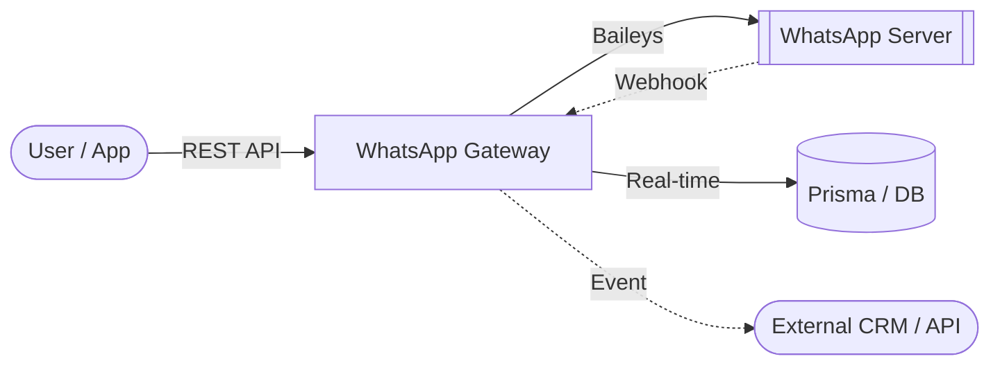

<div align="center">

# 🚀 WhatsApp Server: The Ultimate Gateway & Dashboard

[](https://wa.me/)
[](https://nextjs.org/)
[](https://www.typescriptlang.org/)
[](https://www.prisma.io/)
[](https://github.com/Salamon2608/whatsapp_server)

**A professional, multi-session WhatsApp Gateway, Dashboard, and Automation System.**  
Built with **Next.js**, **React**, and **Baileys** for high-performance messaging automation and real-time WhatsApp Gateway services.

> [!TIP]
> **New in this version!** Advanced Dashboard reporting with interactive **Webhook Logs** and **Message Logs** visualizations, plus auto-refresh capabilities for real-time monitoring.

[Features](#-key-features) • [User Guide](docs/USER_GUIDE.md) • [API Documentation](docs/API_DOCUMENTATION.md) • [Database Setup](docs/DATABASE_SETUP.md) • [Installation](#-quick-installation)

</div>

---

## 🌟 Why WhatsApp Server?

Transform your WhatsApp into a fully programmable RESTful API with a stunning management interface. Designed for scale, reliability, and ease of use, making it the perfect bridge between your business logic and WhatsApp's global reach. Excellent for developing a **WhatsApp Bot**, Automation, or Customer Service Gateway.

### 🏗️ How it Works



---

## 🔥 Key Features

- **📱 Multi-Session Management**: Connect and manage unlimited WhatsApp accounts simultaneously via simple QR code scans.
- **📊 Real-Time Dashboard & Logs (NEW!)**: Track your API usage with the built-in Reports dashboard for Webhooks and Messages.
- **⚡ Pro WhatsApp Engine**: Powered by `@whiskeysockets/baileys` for high-speed, stable, and secure WebSocket connections.
- **📅 Advanced Scheduler**: Precise message planning with **Media Support** (Images, Video, Docs).
- **📢 Safe Broadcast**: Built-in anti-ban mechanisms with randomized delays (10-30s) and batch processing.
- **🤖 Smart Auto-Reply**: Keywords matching with **Context Support** (Group/Private/All) and **Media Attachments**.
- **🔗 Enterprise Webhooks**: Robust real-time event forwarding for messages, connections, status changes, and group updates.
- **🛡️ Granular Access Control**: Full **Whitelist** & **Blacklist** support for both Bot Commands and Auto Replies.
- **📘 Open API Spec**: Fully documented via `swagger-ui-react` at `/docs`.

<details>
<summary>📂 <b>View Webhook Payload Example</b></summary>

```json
{
  "event": "message.received",
  "sessionId": "xgj7d9",
  "timestamp": "2026-01-17T05:33:08.545Z",
  "data": {
    "key": { "remoteJid": "6287748687946@s.whatsapp.net", "fromMe": false, "id": "3EB0B78..." },
    "from": "6287748687946@s.whatsapp.net",
    "sender": "100429287395370@lid",
    "type": "TEXT",
    "content": "Hello! I am a reply",
    "isGroup": false
  }
}
```
</details>

---

## 🚀 Quick Installation

### 1. Prerequisites
- Node.js 20+
- MySQL or PostgreSQL
- Git

### 2. Setup
```bash
# Clone the repository
git clone https://github.com/Salamon2608/whatsapp_server.git
cd whatsapp_server

# Install dependencies
npm install

# Configure environment
cp .env.example .env
# Edit .env with your DATABASE_URL, AUTH_SECRET, PORT, etc.

# Push schema and generate Prisma Client
npm run db:push

# Create SuperAdmin account
npm run make-admin admin@example.com password123
```

### 3. Run (Development)
```bash
npm run dev
```

---

## 📚 API Reference Overview

The WhatsApp Server provides a comprehensive REST API to integrate WhatsApp Messaging directly into your applications. Full details in [API_DOCUMENTATION.md](docs/API_DOCUMENTATION.md).

> [!TIP]
> Use the built-in **Swagger UI** for interactive exploration at `/docs`.

| Method | Endpoint | Description |
| :--- | :--- | :--- |
| `POST` | `/api/messages/{sessionId}/{jid}/send` | Send text, media, or stickers |
| `POST` | `/api/messages/{sessionId}/broadcast` | Scalable bulk messaging |
| `GET` | `/api/reports/webhooks` | Fetch paginated webhook logs with statistics |
| `GET` | `/api/reports/messages` | Fetch paginated message logs with statistics |
| `POST` | `/api/webhooks/{sessionId}` | Register real-time event listeners |
| `POST` | `/api/autoreplies/{sessionId}` | Create context-aware auto-replies |

### Example: Send Text Message (PowerShell)
```powershell
$headers = @{
    "X-API-Key" = "your_api_key_here"
    "Content-Type" = "application/json"
}
$body = @{
    message = @{
        text = "Hello from WhatsApp Server!"
    }
} | ConvertTo-Json -Depth 5

Invoke-RestMethod -Uri "http://localhost:3000/api/messages/session_01/919876543210@s.whatsapp.net/send" -Method Post -Headers $headers -Body $body
```

---

## 🛡️ Security
- **API Key Auth**: Secured endpoints using `X-API-Key` header.
- **RBAC**: Multi-role support (`SUPERADMIN`, `OWNER`, `STAFF`).
- **Encrypted Passwords**: All passwords hashed with bcrypt.
- **JWT Encryption**: Session tokens signed securely.
- **Input Validation**: Zod schemas on critical endpoints.

---

<div align="center">
  Built with ❤️ for Seamless WhatsApp Integrations<br/>
  Licensed under <a href="LICENSE">MIT</a>
</div>
